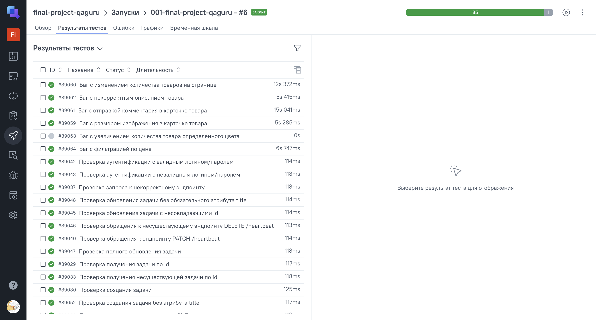

# Дипломный проект автоматизации тестирования

## Описание
В этом репозитории представлен мой дипломный проект по автоматизированному тестированию. В рамках работы я реализовала тесты для проверки веб-приложения и REST API, используя современные подходы и инструменты. 

В проекте используются следующие учебные ресурсы, адаптированные под отработку UI и API автотестов:
- academybugs.com — сайт с багами для практики UI-тестов.
- apichallenges.herokuapp.com — открытое REST API для отработки навыков тестирования бэкенда.

## Технологический стек


Проект реализован с использованием современных инструментов для автоматизации тестирования:

#### Языки и фреймворки
- **JavaScript** - основной язык для написания автотестов
- **Playwright** - мощный фреймворк для end-to-end тестирования веб-приложений

#### Инфраструктура
- **Jenkins** - система непрерывной интеграции для scheduled-запусков
- **GitHub Actions** - CI/CD для запуска тестов при push-событиях

#### Система контроля версий
- **GitHub** - хранение кода, CI/CD (Actions), публикация отчётов (Pages)

#### Анализ результатов
- **Allure Report** - детальная визуализация результатов тестирования
- **Allure TestOps** - централизованное хранение истории запусков
- **GitHub Pages** - хостинг для публикации отчетов

#### Коммуникация
- **Telegram Bot** - автоматические уведомления о результатах тестов

## Локальный запуск тестов
Клонировать репозиторий на компьютер:
```
git clone https://github.com/katefrommoon/final-project-qaguru.git
```
Установка **node.js.**:
```
npm install
```
Инициализация нового проекта **playwright**:
```
npm init playwright@latest
```
Установка **allure**:
```
npm i allure-playwright
npm add allure
```
Запуск тестов:
```
npm t
```
Генерация отчета **allure**:
```
npx allure awesome ./allure-results --single-file
```
## Как запустить тесты через [**Jenkins**](https://jenkins.autotests.cloud/)
Чтобы запустить пайплайн, нужно сделать следующее:

1. Зайти в Jenkins:
авторизоваться под своими учетными данными или пройти быструю регистрацию.
2. Открыть нужную [джобу](https://jenkins.autotests.cloud/job/001-final-project-qaguru/)
3. Запустить сборку: 
Нажать кнопку **Build Now** для старта пайплайна.

**После завершения сборки:**

Будет сформирован Allure-отчет, содержащий детальную информацию о результатах тестирования.
Результаты сборки будут автоматически отправлены в Allure TestOps для дальнейшего анализа.
Уведомление о статусе выполнения будет отправлено в Telegram , что позволяет оперативно отслеживать результаты.

## Пример сформированного отчёта Allure
[Ссылка на отчёт](https://katefrommoon.github.io/final-project-qaguru)


## Отчет в TestOps
[Ссылка на проект](https://allure.autotests.cloud/project/4840/launches)


## Отправка результатов прогона в Telegram
